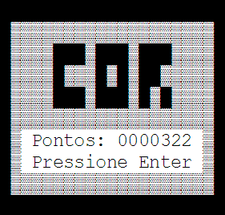

# Cor

> Um simples jogo de corrida.

## Como Jogar

Acesse-o em &lt;https://joguinhos.github.io/cor/&gt;, e use:

 - <kbd>ENTER</kbd> — Para iniciar ou reiniciar o jogo.
 - <kbd>↑</kbd> ou <kbd>↓</kbd> — Para movimentar o personagem para cima ou para baixo.
 - <kbd>P</kbd> — Para pausar o jogo (use <kbd>ENTER</kbd> para continuá-lo).
 - <kbd>S</kbd> — Para desativar ou ativar o som do jogo.
 - <kbd>ESC</kbd> — Para voltar na tela inicial (apenas se o jogo já estiver acabado).

## Crédito de Arquivos

 - `css/blinkftw.css` — [blinkftw](https://github.com/mrdoob/blinkftw) (de Mr.doob).
 - `audio/*` — [WavSource.com](http://www.wavsource.com/sfx/sfx.htm).

## Licença

MIT &copy; [Matheus Alves](https://twitter.com/theuves)
